## 为什么需要这样一个工作台

在学术研究与论文写作过程中，真正耗费精力的往往不只是写作本身。研究者需要同时管理期刊信息、稿件进度、投稿记录、审稿节点、已刊成果、日程安排、附件材料等。期刊是否适合投稿，稿件当前处于哪个阶段，某篇文章投过哪些刊物，哪些任务即将逾期，哪些资料需要补充，哪些已刊论文还能追溯原稿信息——这些内容一旦分散在表格、文档、聊天记录、文件夹和个人记忆里，时间一长就很容易失控。

Article-Tool 正是为了解决这种复杂而细碎的学术管理需求而做的本地化软件。它不是一个简单的期刊表格，也不是单纯的待办清单，而是把期刊库、稿件库、已刊论文库、学术会议、基金项目、日程、AI 报告、附件、备份和个性化设置等能力整合在一起的综合工作台。它以研究者的实际工作流为中心，将选题、写作、投稿、审稿、转投、发表、归档、复盘等过程放进同一个系统，让学术生产过程变得更加清晰、连续和可追踪。

这篇文章是对 Article-Tool 的完整介绍。你可以把它理解为一份产品导览：先看软件解决什么问题，再看每个模块如何对应真实学术工作流，最后再理解字段自定义、AI 报告和个性化设置这些长期使用时会越来越重要的能力。

## 软件定位：不是资料表，而是学术生产工作台

Article-Tool 的核心定位可以概括为：围绕期刊、稿件、已刊论文、学术会议、基金项目和日程任务，建立一个本地化、可自定义、可追溯、可 AI 分析的学术工作系统。

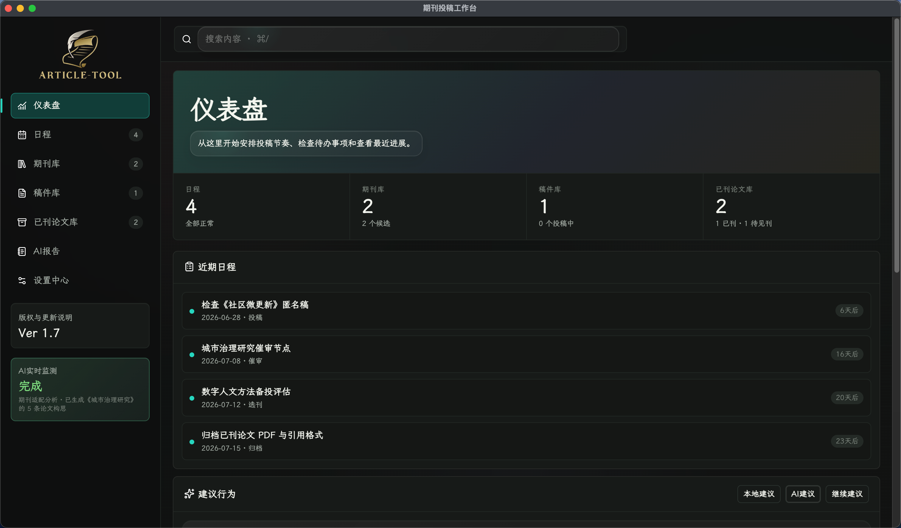

图 1：Article-Tool 主界面

传统管理方式通常有几个问题。第一，期刊资料和稿件资料分离。一个表格记录期刊，一个文档记录论文，一个日历记录任务，之间没有稳定关联。第二，投稿过程缺乏连续记录。某篇稿件何时投了哪家期刊、是否退稿、是否返修、转投依据是什么，往往散落在邮件和备忘录中。第三，已发表论文归档后与原稿脱节。发表信息保存了，但原稿阶段的关键词、目标期刊、写作记录、投稿流程可能丢失。第四，研究者很难快速做阶段复盘。要知道自己有多少可投期刊、多少稿件待推进、哪些任务逾期，需要重新翻找大量资料。第五，AI 工具虽然有帮助，但如果不能接入自己的完整本地资料库，生成的建议就容易泛泛而谈。

Article-Tool 的设计思路正好针对这些痛点。它把期刊、稿件、已刊论文、会议和项目作为互相关联的资料对象，把日程作为时间轴，把投稿流程作为行动记录，把字段系统作为个性化结构，把 AI 报告作为复盘与辅助决策工具，把本地数据层作为安全底座。这样，用户不只是「存资料」，而是在软件里构建一套属于自己的学术工作流。软件左侧导航包含几个主要页面：仪表盘、日程、期刊库、稿件库、已刊论文库、AI 报告和设置中心。这些页面不是孤立存在的，而是互相联通的。

### 仪表盘：一眼看清当前学术工作状态

仪表盘是软件的总控页面。它负责把分散在各个资料库和日程中的信息压缩成一个清晰的工作概览。

仪表盘顶部显示软件当前的整体统计，包括日程数量、期刊库数量、稿件库数量和已刊论文库数量。对于长期积累资料的用户来说，这种统计能快速反映资料库规模，也能帮助用户判断当前工作重点。例如，如果稿件很多但可投期刊较少，就说明需要补充期刊储备；如果期刊库很充实但稿件推进缓慢，就说明重点应放在写作计划上；如果日程中逾期任务较多，就需要优先处理时间风险。

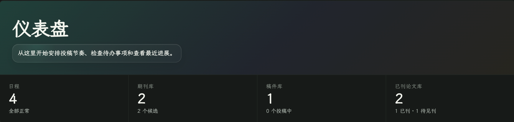

图 2：仪表盘-总览

仪表盘中的「近期日程」模块会展示当前和未来需要处理的任务。任务可以来自日程页，也可以从具体期刊、稿件或已刊论文详情页中添加。这样用户不需要进入每个对象页面，也能在仪表盘看到近期需要推进的事项。任务支持完成、编辑、删除和延期等操作，能够帮助用户快速整理当天或近期的工作。

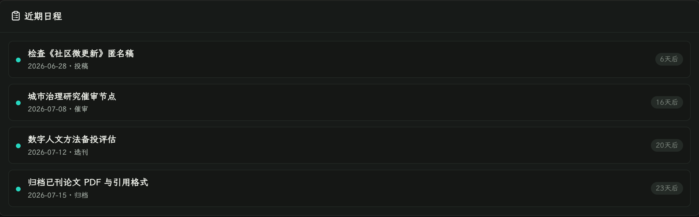

图 3：仪表盘-近期日程

「建议行为」是仪表盘的重要增强功能。它包含本地建议和 AI 建议两种模式。本地建议根据资料库中已有数据自动分析，例如哪些任务逾期、哪些稿件处于待投稿状态、哪些期刊资料还需要补充、哪些投稿流程停滞过久。AI 建议则可以在配置 API 后进一步增强，让模型基于当前资料库生成更具体的行动建议。这个功能让仪表盘不只是静态展示数据，而是主动提醒用户下一步可以做什么。

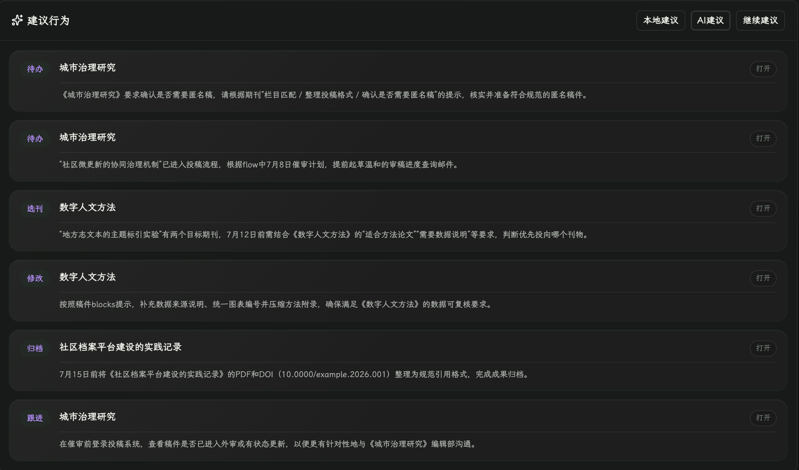

图 4：仪表盘-建议行为

「投稿动态」模块会汇总稿件和已刊论文中的投稿流程记录，展示近期投稿、审稿、返修、转投或复盘动态。它相当于一个投稿过程的时间预览，让用户不用打开每篇稿件，也能了解最近发生了哪些关键动作。

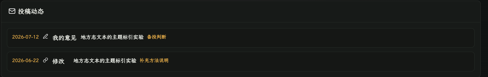

图 5：仪表盘-总览

仪表盘还支持全局搜索。当用户在顶部搜索框中输入关键词，系统会在不同资料库、字段、内容块和流程中寻找相关内容，并根据匹配结果展示。用户可以按范围筛选，例如全部、页面、期刊库、稿件库、已刊论文库、日程等。搜索结果可以直接跳转到对应页面或对象详情页。

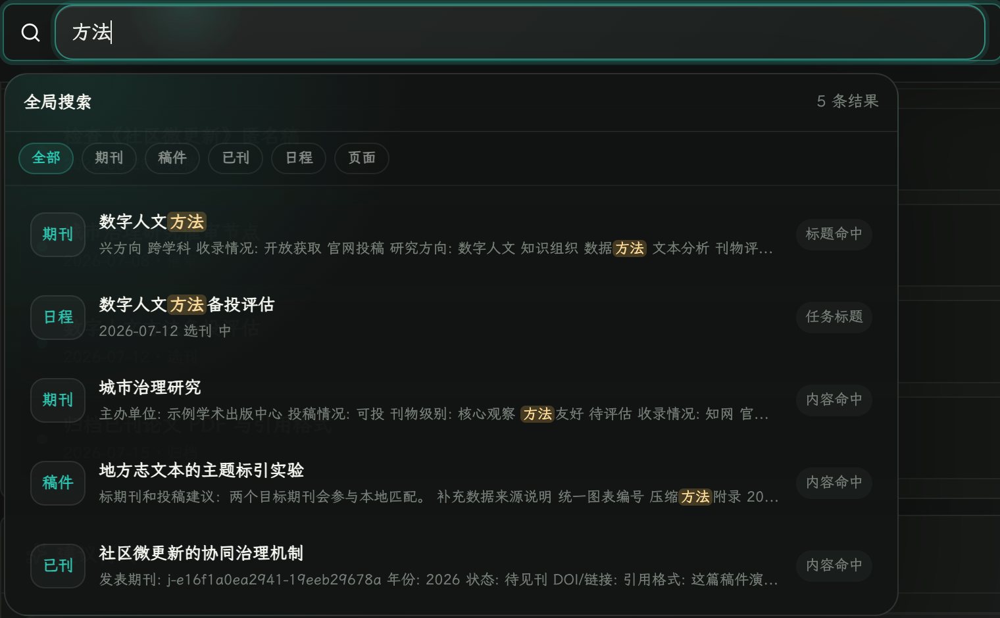

图 6：全局搜索

### 日程系统：把学术任务放进时间轴

日程页面是软件的时间管理中心。它采用月历视图展示任务，并结合右侧或下方工作区显示选中日期的具体任务列表。用户可以在某一天添加任务，也可以从对象详情页直接添加与某个期刊、稿件或已刊论文相关联的任务。

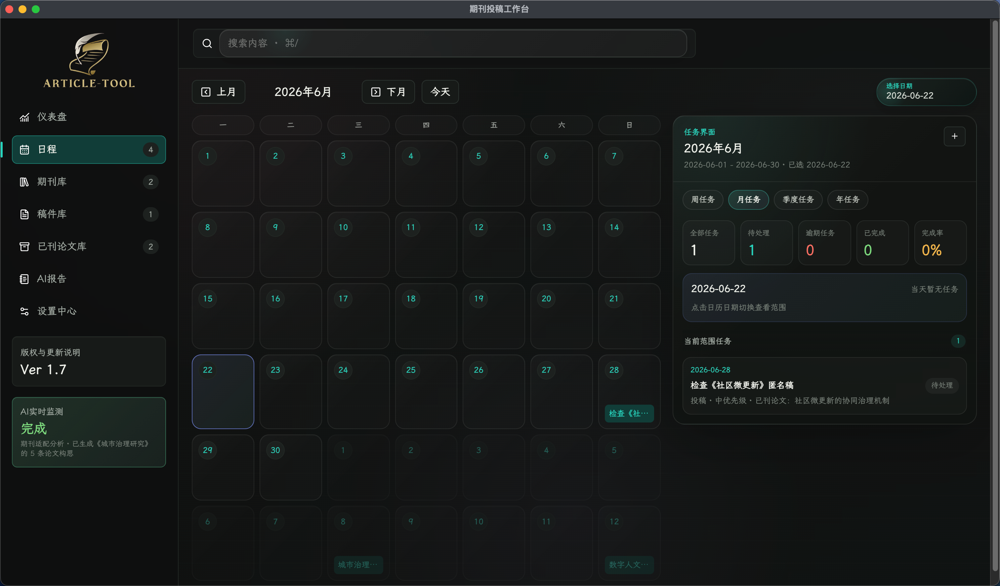

图 7：日程-界面

任务包含日期、标题、类型、优先级、备注和关联对象等信息。优先级支持高、中、低，软件会根据优先级和日期进行排序。任务可以标记完成，也可以恢复未完成状态。对于延期事项，软件提供快捷的延期操作，例如将任务向后顺延一天或多天。任务也可以被删除或重新编辑。

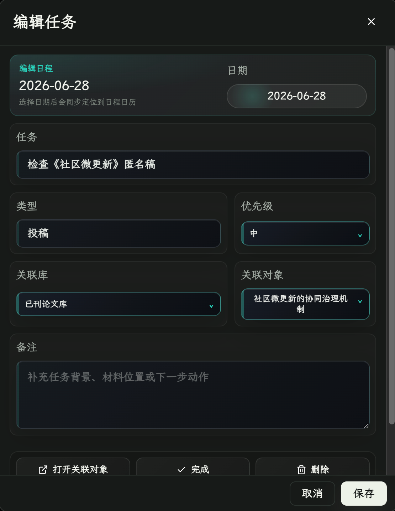

图 8：日程-编辑任务界面

日程页面支持月份切换，可以查看上月、下月，也可以一键回到今天。软件内置日期选择器，用户可以快速定位到某个具体日期。日期选择器不仅显示日期，还会提示所选日期是否已有任务。日历中的每一天会显示任务预览，如果某天任务过多，会以“更多”的方式提示，避免界面过度拥挤。

任务与资料库对象之间可以建立关联。例如，某个任务可以关联到一篇稿件，表示这篇稿件需要修改摘要；也可以关联到某个期刊，表示需要核查投稿要求；也可以关联到某篇已刊论文，表示需要补充 DOI 或引用格式。关联后的任务会出现在对应对象详情页的“相关日程”区域中，实现资料和行动的双向连接。

日程系统还支持拖拽式任务调整。用户可以将任务拖到新的日期，从而快速重排计划。这种设计非常适合学术写作中频繁变化的现实场景：审稿回复延迟、材料没准备好、临时会议插入、投稿计划改变，都可以通过拖动和延期快速调整。

### 期刊库：建立个人化投稿目标数据库

期刊库是软件的核心资料库之一，用于保存、整理、评估和筛选可投期刊。默认字段包括主办单位、投稿情况、刊物级别、收录情况、研究方向、刊物评价、刊期、相关链接和投稿难度等。这些字段覆盖了投稿决策中最常用的信息。

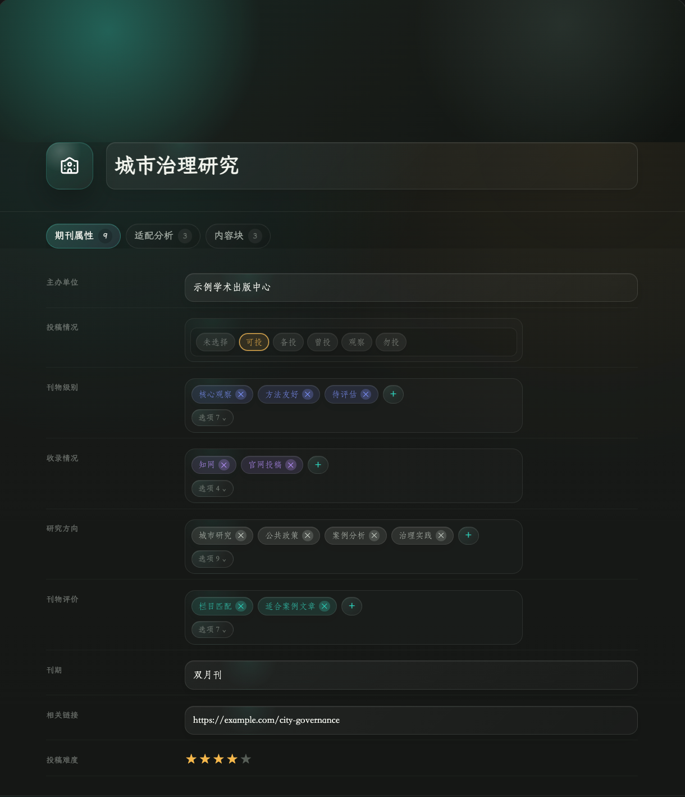

图 9：期刊库-主页面（期刊属性，部分）

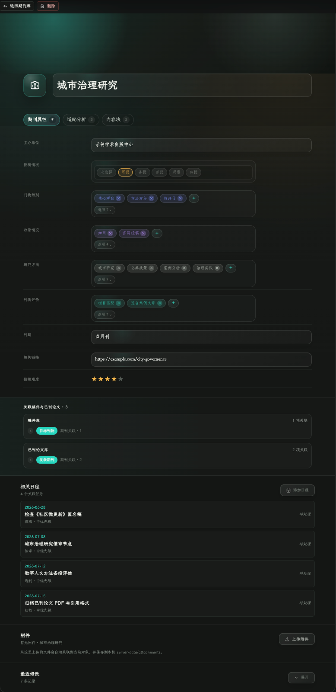

图 10：期刊库-主页面（期刊属性，全部）

期刊库支持表格视图和卡片视图。表格视图适合批量浏览和对比字段；卡片视图适合更视觉化地查看期刊重点信息。用户可以切换视图，也可以控制哪些字段在表格中显示，哪些字段在卡片中显示。表格还支持「最适排版」，系统会根据当前表格内容重新计算列宽，让信息展示更舒服。

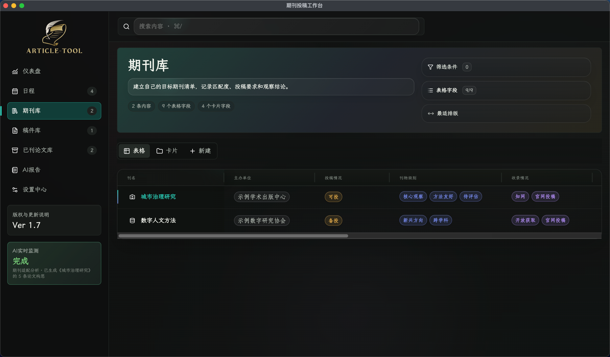

图 11：期刊库-界面-表格视图

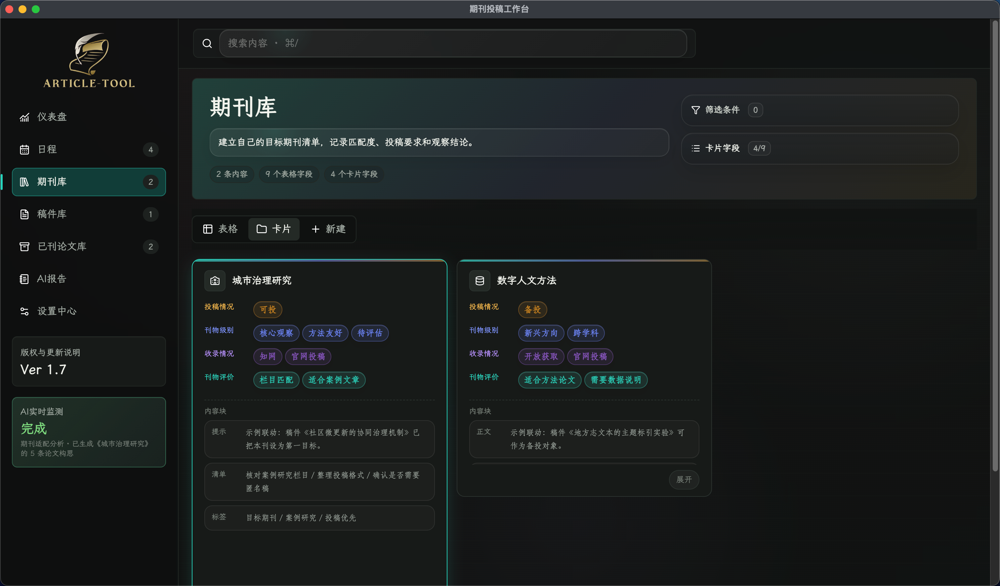

图 12：期刊库-界面-卡片视图

期刊详情页不仅展示字段属性，还包含内容块、附件、最近修改记录和关联信息。用户可以为某个期刊添加正文块、提示块、引用/心得、清单和标签块，用于记录更复杂的材料。例如可以添加「投稿须知摘要」「近期栏目观察」「适合选题列表」「投稿经验」等内容。

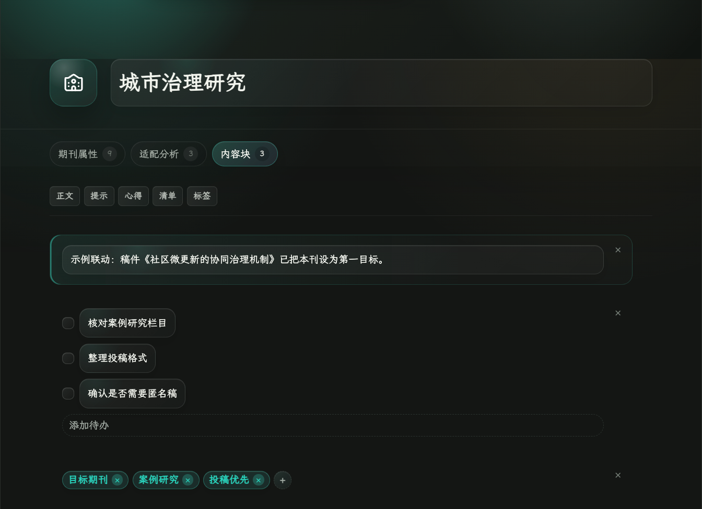

图 13：期刊库-主页面（内容块）

期刊详情页还支持「适配分析」分页面。系统会根据期刊资料、研究方向、内容块以及与该期刊相关联的稿件或已刊论文，生成本地论文构思建议。配置 AI 后，还可以生成 AI 增强版论文构思。每条构思会包含论文题目、适配度、构思说明、风险提醒和下一步建议。这个功能让期刊库不再只是被动记录期刊，而是可以反向启发选题。

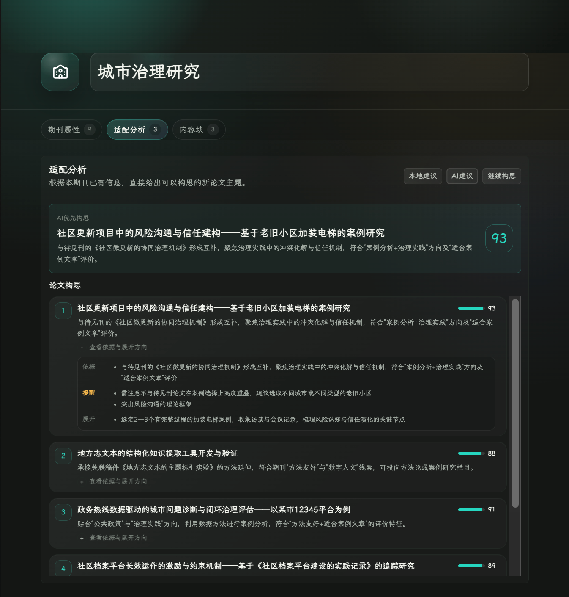

图 14：期刊库-主页面（适配分析）

### 稿件库：管理从选题到投稿的完整写作过程

稿件库用于管理正在构思、写作、打磨、待投稿、投稿中或已发表的论文。默认字段包括写作状态、关键词/方向、目标刊物、字数和优先级。

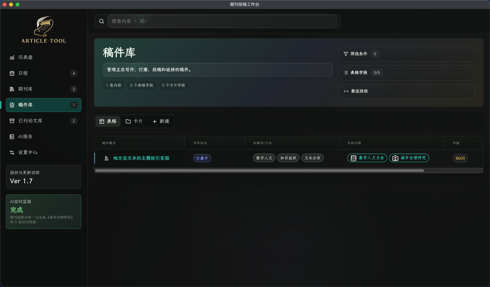

图 15：稿件库-界面

稿件详情页具有多个分页面：稿件属性、投稿建议、投稿流程和内容块。稿件属性用于管理结构化字段；投稿建议用于分析稿件适合投稿哪些期刊；投稿流程用于记录投稿、退稿、返修、转投等过程；内容块用于保存正文相关资料、写作计划、摘要、修改意见、参考线索等。

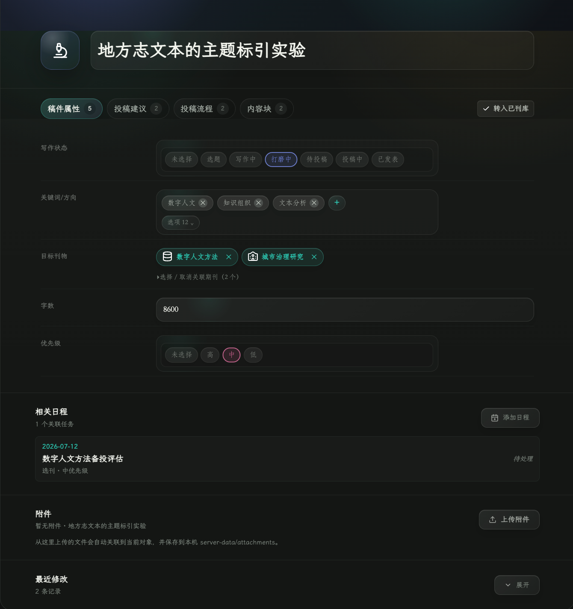

图 16：稿件库-主页面（稿件属性）

投稿建议功能是稿件库的亮点之一。它会根据稿件关键词、目标刊物、字段内容和期刊库信息，生成本地投稿建议。建议中会列出可能匹配的期刊、适配理由、注意事项和资料缺口。如果配置了 AI，还可以进行 AI 增强，让模型基于完整上下文生成更细致的投稿判断。建议项中可以直接打开对应期刊，方便用户进一步查看期刊资料。

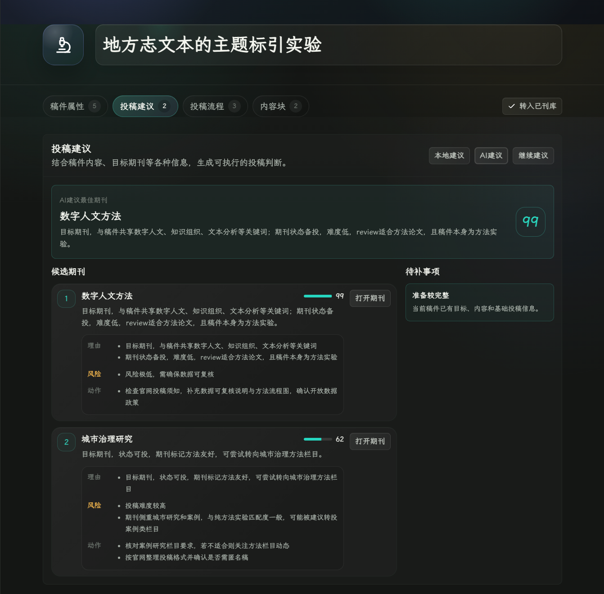

图 17：稿件库-主页面（投稿建议）

投稿流程功能用于记录稿件真实投稿轨迹。用户可以为稿件新增投稿期刊，系统会按期刊形成流程分组。每个投稿流程可以记录日期、类型、标题、内容、标签和图标。例如可以记录「初投」「退稿」「返修」「录用」「转投」「我的意见」「综合复盘」等。流程按期刊分栏，用户可以看到某篇稿件对某个期刊的完整互动过程。

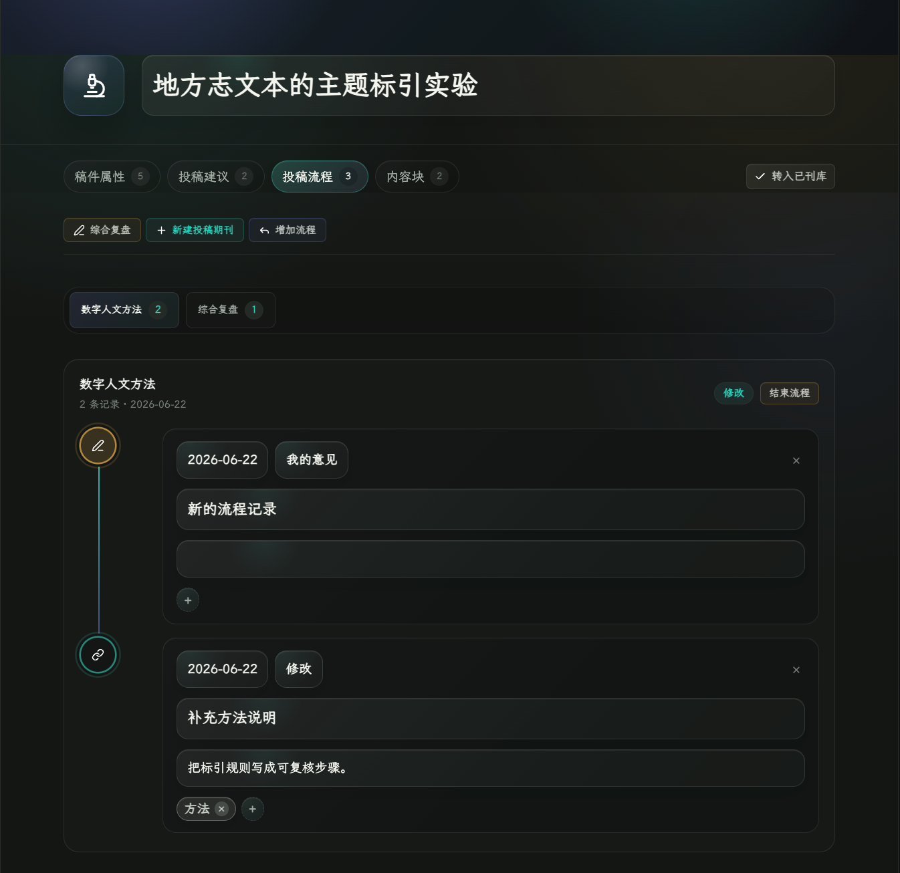

图 18：稿件库-主页面（投稿流程）

系统还支持「综合复盘」。当一篇稿件经历多轮投稿或需要重新判断策略时，用户可以打开综合复盘，记录整体判断、转投策略和后续修改计划。这个设计很贴近实际写作，因为投稿失败不只是一个结果，更重要的是复盘原因：选题不合、篇幅不符、理论不足、材料薄弱，还是期刊风格不匹配。

稿件库还提供「转入已刊库」功能。当一篇稿件发表后，用户可以将它归档到已刊论文库。转入时，系统会保留原稿信息、投稿流程和相关字段快照，避免发表后丢失写作过程。这个功能让稿件从“正在推进”自然进入“成果归档”。

### 已刊论文库：让发表成果和原稿过程不断裂

已刊论文库用于管理已经发表、待见刊、校样或已收录的论文。默认字段包括发表期刊、年份、状态、DOI/链接和引用格式。

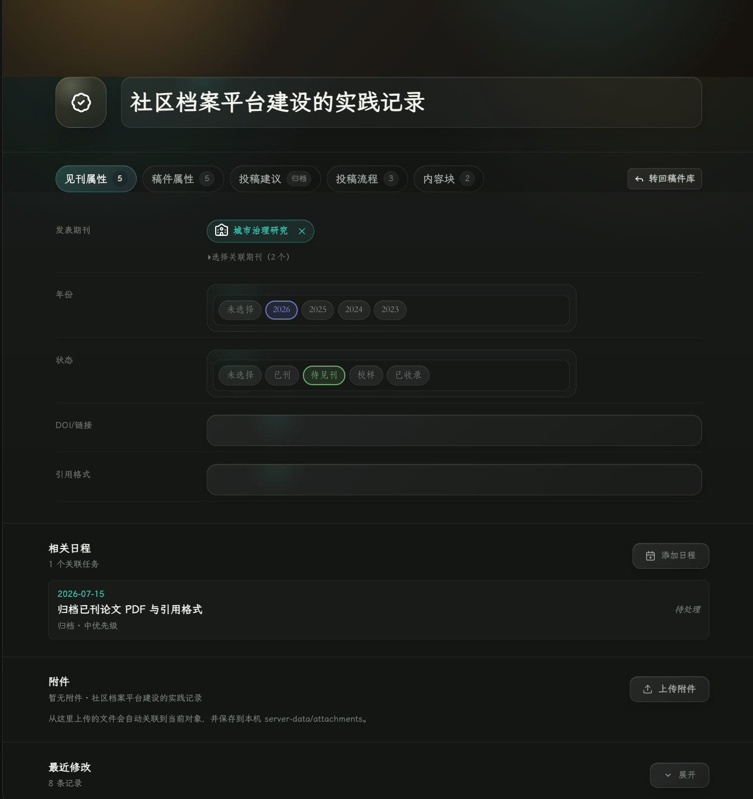

图 19：已刊论文库-主页面（见刊属性）

已刊论文详情页比普通成果表更强大，因为它不仅保存「见刊属性」，还可以保留「稿件属性」。当稿件从稿件库转入已刊论文库时，系统会创建原稿快照，包括当时的稿件字段、属性和投稿流程。这意味着论文发表后，用户仍然可以追溯它在写作阶段的关键词、目标刊物、优先级、字数、流程记录和内容块。

已刊论文库还支持「转回稿件库」。如果某条记录需要重新作为稿件处理，或者用户误将稿件归档为已刊论文，可以将其转回稿件库。转回时，系统会尽量恢复原稿字段和流程，并重新关联任务和附件。这种库间移动能力体现了软件对真实工作流的理解：学术成果管理不是单向的，数据需要可恢复、可调整、可追溯。

需要注意的是，Article-Tool 的一个关键设计是「期刊关联」。稿件库中的目标刊物字段、已刊论文库中的发表期刊字段，都是与期刊库建立真实关系的字段。用户选择的不是普通文本，而是期刊库中的对象。

图 20：期刊关联

这种设计带来几个好处。第一，减少重复录入。期刊名称、链接、评价、方向等信息只需要在期刊库维护一次。第二，便于跳转。用户可以从稿件或已刊论文直接打开关联期刊。第三，便于反向查看。期刊详情页可以显示有哪些稿件或已刊论文关联到它。第四，便于 AI 分析。系统可以把期刊资料和相关稿件、已刊成果一起作为上下文，让建议更具体。

软件还包含期刊链接适配与迁移逻辑，可以处理旧数据中用期刊名称保存的情况，尽量迁移到新的 ID 关联方式。这样即使软件结构迭代，用户过去的数据也能继续可用。

### 学术会议与基金项目：把外部节点纳入研究工作流

除了期刊、稿件和已刊论文，Article-Tool 也逐步把学术会议、基金项目等外部节点纳入同一个工作台。原因很简单：真实的学术生产并不只发生在论文文件内部，很多选题线索、修改方向、阶段任务和成果归集，都来自会议交流、项目节点或基金申报过程。

学术会议模块可以记录会议名称、时间、地点、报告主题、参会情况、反馈内容和后续行动。对研究者来说，会议不只是一次活动，而是可能转化为论文选题、投稿方向、合作线索或阶段复盘的资料来源。把会议记录和稿件、日程、附件放在一起，能够让这些线索不再散落在临时笔记里。

基金项目模块则更适合管理长期任务。项目从申报、立项、执行到结项，往往伴随多个时间节点、材料附件、阶段成果和论文产出。Article-Tool 会把项目资料、经费信息、进度节点和成果归集放进同一套资料结构中，让基金项目不再只是一个单独文件夹，而是可以和论文、会议、日程产生关联的研究对象。

### AI 报告：把本地资料转化为阶段分析

AI 报告是软件中最具扩展性的功能之一。它可以基于期刊库、稿件库、已刊论文库、学术会议、基金项目、日程任务和投稿流程，生成结构化分析报告。

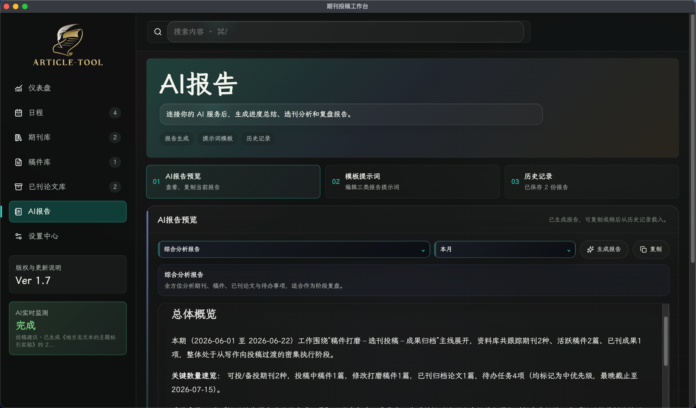

图 21：AI报告-AI报告预览

软件内置三类报告模板：综合分析报告、写作进度追踪和周期复盘报告。

综合分析报告适合做阶段性总览。它会分析期刊储备、可投状态、稿件进度、已刊成果、待办任务和下一步建议。对于月末、学期末、项目节点或年度总结来说，这类报告很实用。

写作进度追踪聚焦稿件。它会分析每篇稿件当前状态、目标期刊、投稿记录、审稿动态、卡点和下一阶段写作计划。对于同时推进多篇论文的用户来说，这能帮助重新排序工作重心。

周期复盘报告按时间范围整理成果、问题和计划，适合直接用于工作汇报、个人复盘或项目记录。它会突出周期内完成事项、成果亮点、进行中事项、风险和下一周期安排。

AI 报告支持选择时间范围。系统会根据用户选择的周期整理数据，而不是无差别地把全部资料丢给模型。报告生成后会在页面中以 Markdown 渲染显示，用户可以复制内容，也可以稍后从历史记录中载入。

报告历史会自动保存到本地，最多保留 40 份。每份历史记录包含模板名称、日期、周期、模型和内容摘要。用户可以预览、导出、载入或删除历史报告。导出功能可以把某份报告保存成文件，方便长期归档。

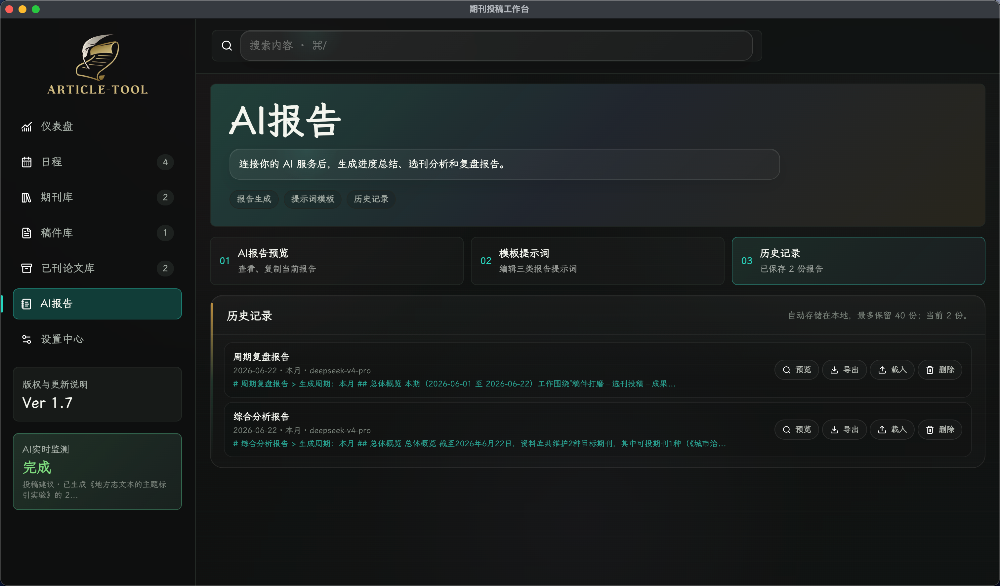

图 22：AI报告-历史记录

AI 报告还支持模板提示词编辑。默认模板可以微调，自定义模板可以新增、编辑和删除。每个模板包含系统提示词和用户提示词。用户可以根据自己的写作习惯调整报告风格，例如更偏正式汇报、更偏行动清单、更偏学术分析，或者更适合复制到周报中。

## 具有针对性的独特设计

### 字段体系：让软件适应用户，而不是用户迁就软件

Article-Tool 的字段系统非常灵活。软件默认提供三大资料库的字段，但用户可以在设置中心中增删、改名、排序、改类型、改颜色、设置选项，并控制字段显示。

字段类型包括文本、多选、单选、数字、日期、链接、评分和期刊关联。不同字段类型对应不同输入方式和展示形式。在设置中心的字段体系页面，用户可以看到每个资料库的字段列表。每个字段可以设置名称、类型、颜色、选项和可见性。字段顺序可以上移或下移，影响表格和详情页展示顺序。用户还可以控制全部字段显示或隐藏，也可以单独控制卡片视图中哪些字段出现。

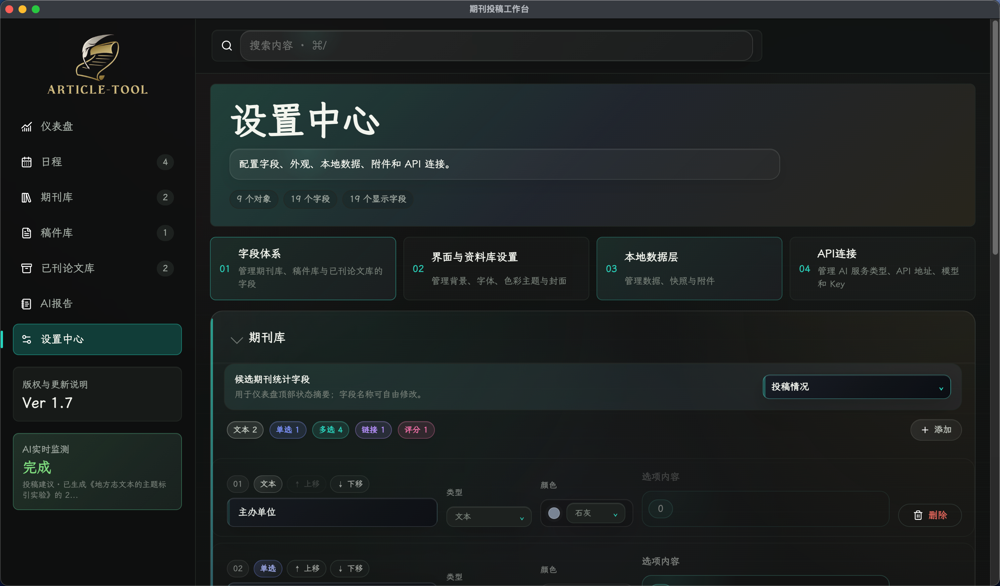

图 23：设置中心-字段体系

对于单选和多选字段，软件提供选项管理。用户可以新增选项，删除选项，也可以搜索选项。删除某个字段选项时，系统会同步清理对象中的对应值，避免出现无效数据。用户在对象中输入新的标签时，系统也会自动把它同步进字段选项，形成动态维护机制。

字段体系还与已刊论文的原稿快照联动。如果用户给稿件库新增字段，系统会同步给已刊论文中保存的原稿快照，保证已发表论文仍能保留与稿件库一致的结构。如果删除稿件字段，也会从已刊论文的原稿快照中同步移除。这个细节体现了软件对长期数据一致性的重视。

### API 连接：支持本地模型与兼容 OpenAI 接口

设置中心中的 API 连接页面负责配置 AI 服务。软件支持 Ollama 本地模型、OpenAI / 兼容 API、DeepSeek 和自定义兼容 API。

API 连接页面可以填写服务类型、配置名称、API 地址、模型名称和 API Key。API Key 可以隐藏或显示。软件支持模型列表获取，连接测试成功后可以保存配置预设。用户可以保存多个配置，例如「DeepSeek 写作」「OpenAI 报告」等，并在需要时切换。

连接测试会访问模型列表接口，并给出连接状态。如果 API Key 错误、模型不存在、网络超时、额度不足或服务异常，软件会给出对应提示。AI 请求由本地后端代理转发，避免前端直接访问时遇到跨域或接口兼容问题。

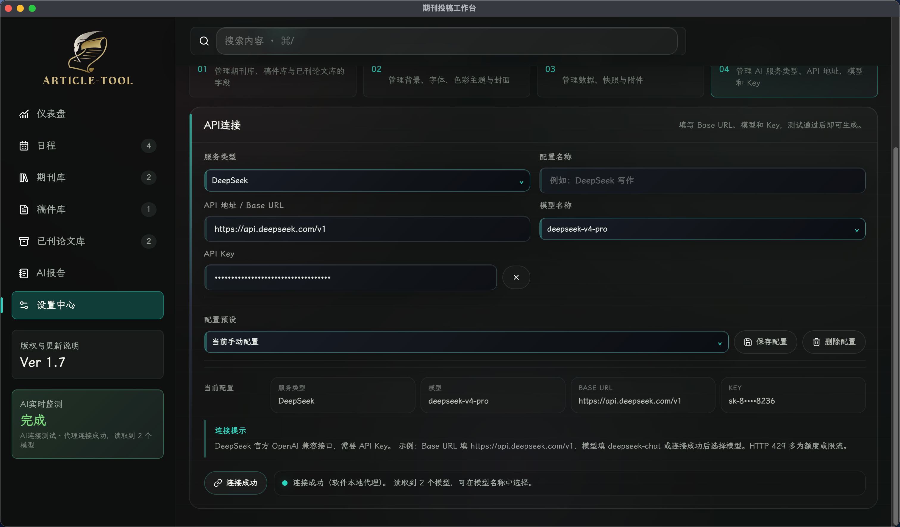

图 24：设置中心-API连接

### AI 实时监测：让 AI 任务可见、可取消、可重试

软件包含 AI 实时监测功能。它会在侧边区域或弹窗中显示 AI 任务状态，例如 AI 报告生成、仪表盘 AI 建议、投稿建议增强、期刊适配分析等。

监测面板可以显示任务来源、目标对象、当前状态、进度、错误信息和运行记录。用户可以打开某个 AI 任务对应的对象页面，也可以取消任务、重试任务或复制错误信息。这让 AI 功能不再像黑箱，而是有一个可观察、可控制的任务中心。

当 AI 任务成功时，系统会记录成功状态；当失败时，会显示失败原因并保留本地建议。比如投稿建议 AI 增强失败，用户仍然可以查看本地建议，不会因为 AI 不可用而完全中断工作。

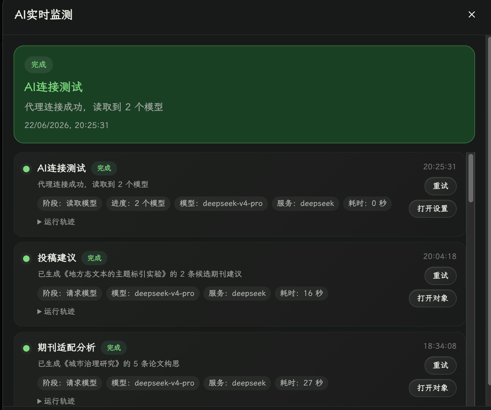

图 25：AI实时监测

### 界面与个性化：让工作台具有个人气质

软件提供丰富的界面设置。用户可以调整软件背景、中文字体、英文字体、字段内容字体、显示密度、强调色、页面名称、页面封面和页面描述。

显示密度支持紧凑、标准和宽松。紧凑适合数据量大、需要高信息密度的用户；宽松适合视觉阅读和长期浏览；标准则是平衡方案。

每个页面的名称和描述也可以自定义。比如用户可以把「稿件库」改成「文学刊物库」，把「已刊论文库」改成「已发表文学作品库」，把「日程」改成「写作计划」。页面顶部描述可以直接编辑，作为个人工作提醒或页面说明。

Logo 也可以切换。软件内置多个品牌 Logo，用户可以点击切换显示。这些个性化设置让软件不像冷冰冰的管理系统，而更像一个可长期陪伴的私人学术工作台。

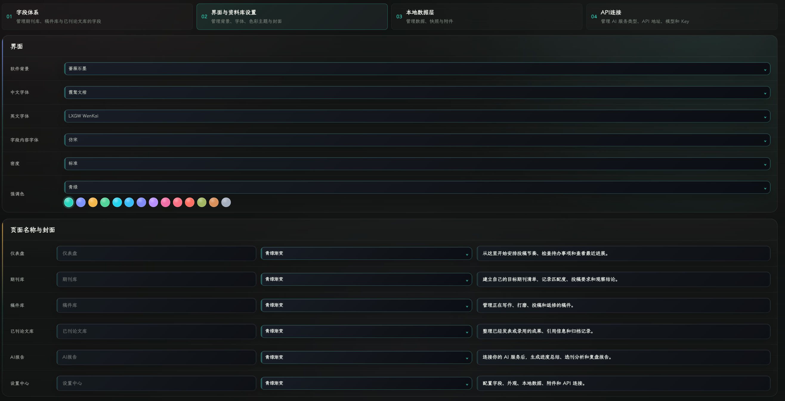

图 26：设置中心-界面与资料库设置

## 适用场景

Article-Tool 适合多类用户。

对于研究生，它可以帮助管理课程论文、学位论文、投稿论文和目标期刊。研究生常常同时面对写作训练、投稿尝试和毕业要求，软件可以把选题、目标期刊、写作状态和导师反馈集中管理。

对于青年教师，它可以作为论文生产和成果归档系统。青年教师往往需要同时推进多篇论文、项目成果和职称成果，软件的稿件库、已刊论文库和周期复盘报告非常适合这种场景。

对于科研团队，它可以作为小型投稿管理工作台。团队成员可以统一维护期刊信息、稿件状态和投稿流程，减少重复踩坑。

对于独立研究者，它可以作为个人学术知识库和行动管理系统。期刊库记录长期观察，稿件库记录写作计划，已刊库记录成果，AI 报告辅助复盘。

## 总结

Article-Tool 是一款围绕学术投稿实际流程设计的本地化软件。它以期刊库、稿件库、已刊论文库、学术会议和基金项目为资料对象，以日程和投稿流程为时间线，以字段系统和内容块为资料结构，以附件和快照为数据保障，以 AI 报告、投稿建议和期刊适配分析为智能增强。

它适合那些不满足于简单表格、希望长期沉淀投稿经验、希望把写作计划和成果归档统一管理的用户。它也适合重视本地数据安全、希望自主选择 AI 服务、希望软件能够根据个人习惯灵活调整的研究者。

在学术工作中，真正困难的不是某一次写作，而是持续写作、持续投稿、持续复盘、持续积累。Article-Tool 的意义就在于，它为这种持续性提供了一个稳定的容器。它把零散信息变成资料库，把待办事项变成时间轴，把投稿经历变成流程记录，把发表成果变成可追溯档案，把 AI 从临时问答变成嵌入式助手。对于长期从事论文写作和期刊投稿的人来说，这样的软件不是一个普通工具，而是一张可以不断扩展的个人学术地图。
